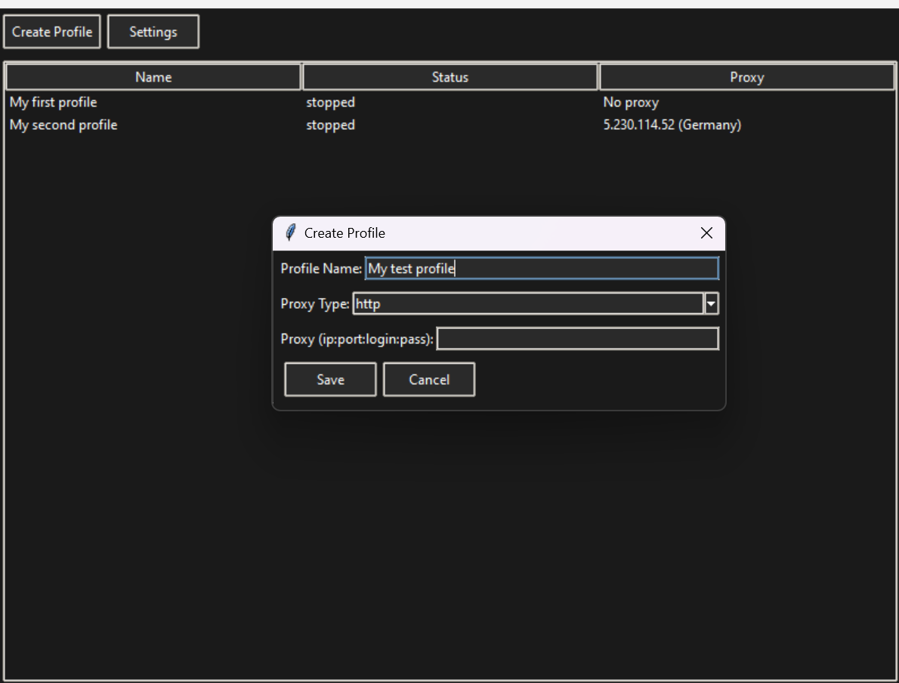
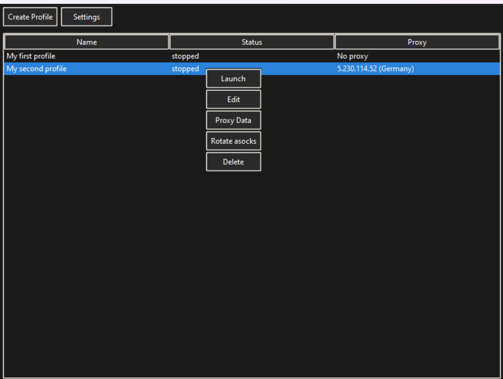

# Antidetect Browser Solution 

**Anti Detect Browser Solution** is a tool for managing Chrome browser profiles, rotating proxies, and automatically setting fingerprints.

## Features

- **Profile Management**: Create and store profiles with preserved user data.
- **Opened pages synchronization**: Solution will keep your opened pages between profile usages.
- **Fingerprint Spoofing**: Spoof User-Agent, screen resolution, and other navigator parts by using [BrowserForge Fingerprints](https://github.com/BrowserForge/BrowserForge), like in paid solutions.
- **Proxy Management**:
  - Supports HTTP (with/without auth) & SOCKS5 (without auth only)
  - GUI interface for proxy configuration
  - ASocks integration for proxy rotation
  - Real-time proxy status monitoring
  - One-click proxy rotation
- **Extension Installation**: Support for extensions. Simply create `extensions` directory in root directory of script, and unpack extension into `extensionName` in `extensions` directory, like `extensions/metamask`

## Configuration

### ASocks API Setup
To use proxy rotation features, you need to configure your ASocks API key:
1. Go to Settings in the main window
2. Enter your ASocks API key
3. The default domain is "https://api.asocks.com"

## Screenshots

## 🎓 Prerequisites

### Make sure you have `Python 3` installed!  

You can download Python [here](https://www.python.org/downloads/).

## Installation

You can download the repository by cloning it to your system and installing the necessary dependencies.

## Quick Start 📚
### To quickly install the required libraries and run the solution by those commands:

Open console / terminal and type `run.bat` on Windows or `run.sh` on Linux or `bash run.sh` on MacOS in root script directory.